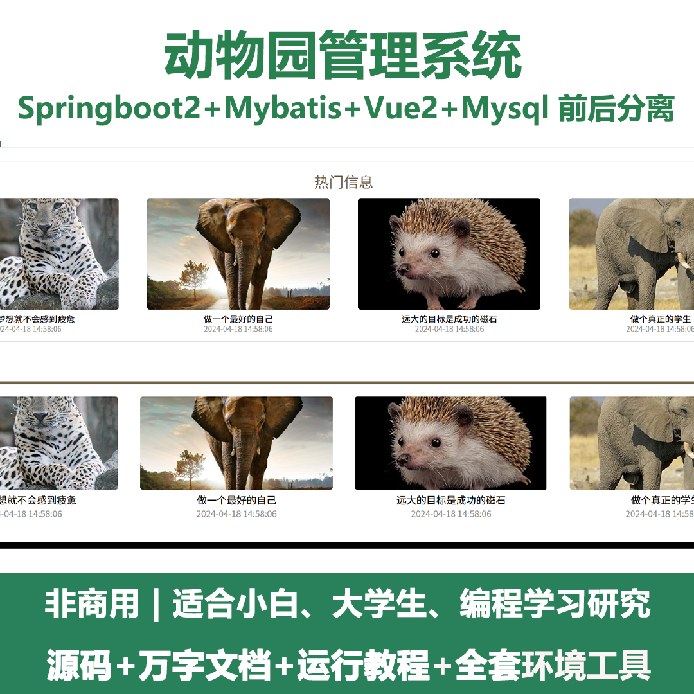
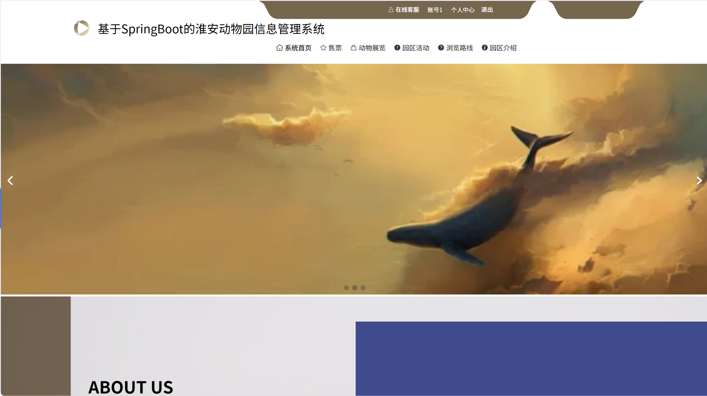
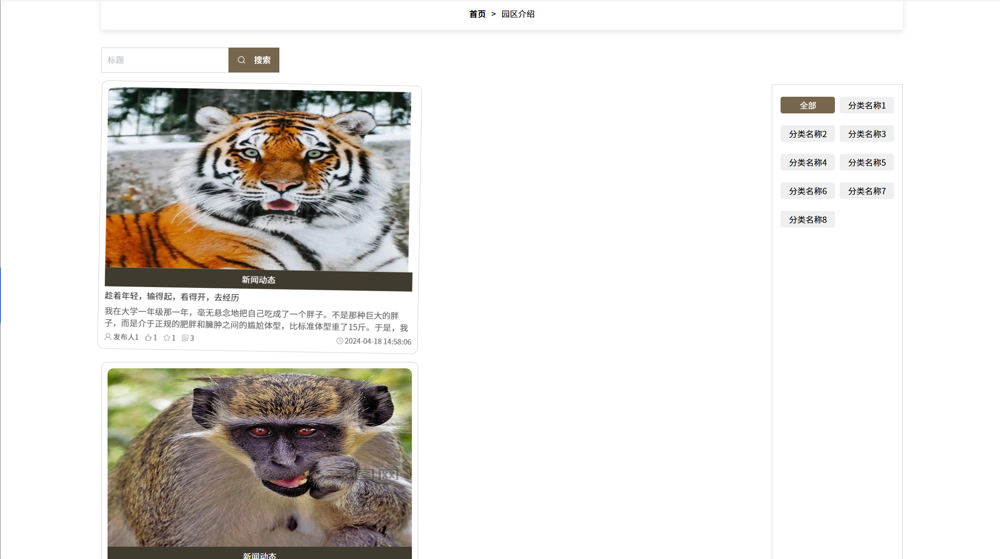
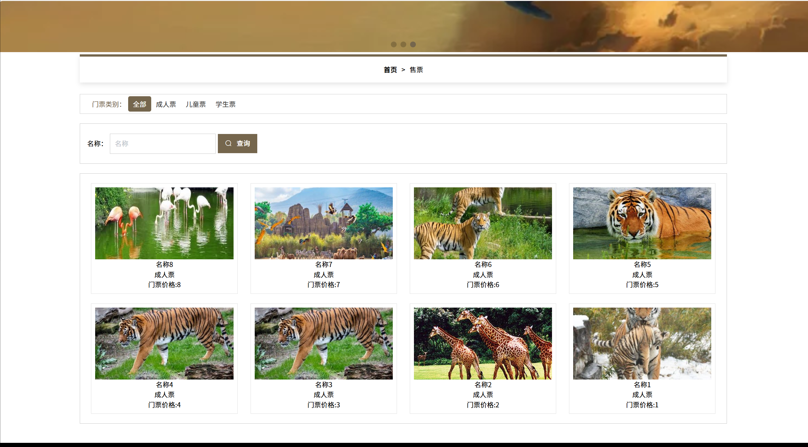
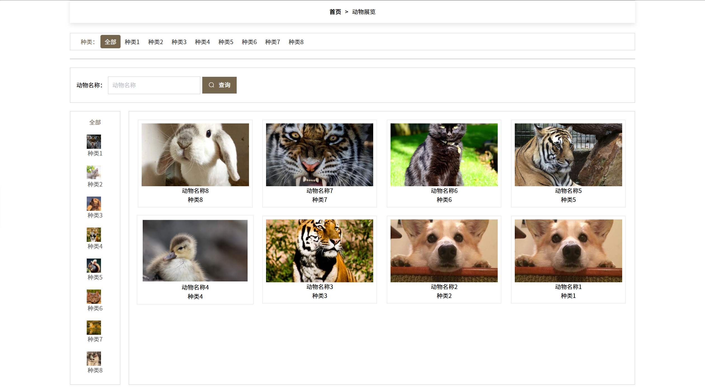
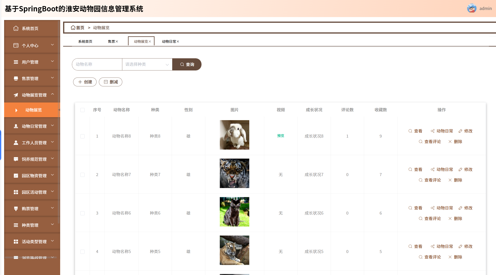
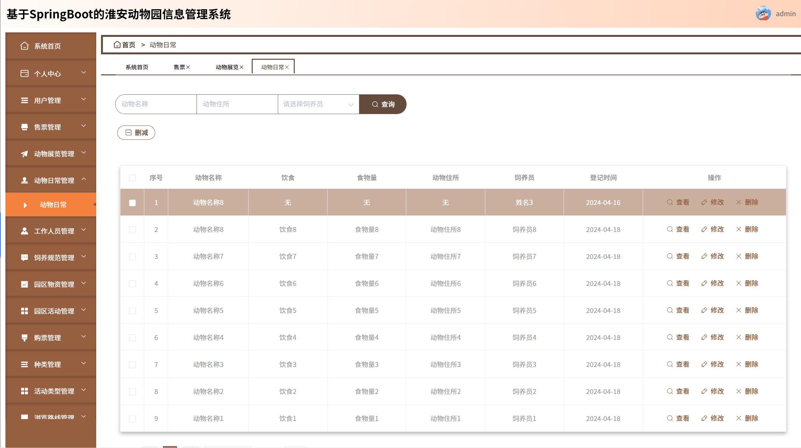
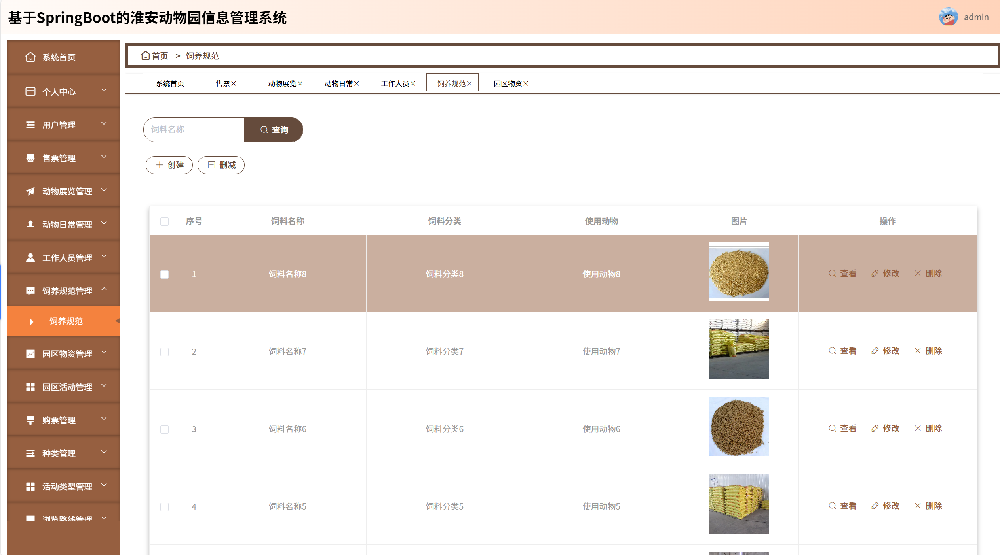
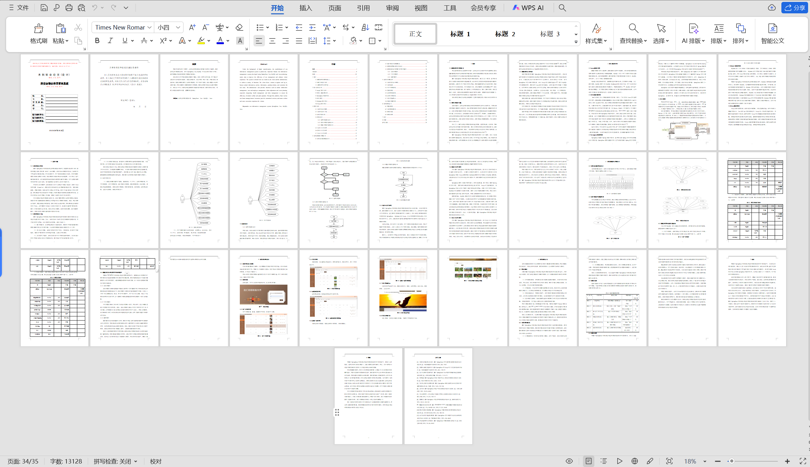

# springbootA412
springbootA412动物园管理系统+LW
 
## 查看主页获取源码

### 一、关键词

野生动物园管理系统，动物园综合管理平台，动物园游客管理系统

 

### 二、作品包含

源码+数据库+设计文档万字+全套环境和工具资源+部署教程

 

### 三、项目技术

前端技术：Html、Css、Js、Vue2.0、Element-ui 
后端技术：Java、SpringBoot2.0、MyBatis

  

 

### 四、运行环境（以下版本亲测，其他版本未知，请自测）

开发工具：IDEA/eclipse  + VSCODE

数据库：MySQL5.7（最低要5.7版本）

数据库管理工具：Navicat10以上版本

环境配置软件： JDK1.8 + Maven3.6.3

前端Nodejs：14

浏览器：谷歌浏览器

 

### 五、项目介绍

项目编号：springbootA412

数字化转型的大背景下，动物园信息管理系统的建立显得尤为重要。淮安动物园信息管理系统，采用SpringBoot, Vue, MySQL和Java技术栈进行开发，旨在提高动物园管理效率并增强访客体验。
该系统分为用户端与管理员端两大模块，实现了多样化的功能。用户端允许访客进行系统注册与登录，浏览动物资料、活动信息、购买门票，并能自定义游览路线；管理员端则提供了动物信息管理、用户和员工管理、票务调整及活动策划等功能，特别是集成了健康管理和日常管理，确保动物福利与园区运营的高效性。通过这一平台，淮安动物园能够更好地管理内部资源，提供定制化服务，同时为游客创造更加丰富、便捷的游览体验。

### 六、运行截图

